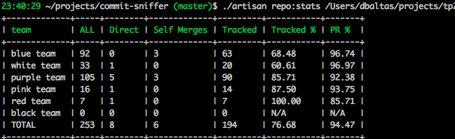

## Commit Sniffer

Reports statistics for a git repo
* direct commits to master (no Pull Requests)
* self merges (John writes, John merges)
* \# of commits that are connected to an issue tracker
* % of Pull Requests in total commits
* % of commits connected to an issue tracker




## Mapping in teams
By mapping git commit authors to team names, you can get results per team rather than per author.


## Setup
> Php 7.0.x, mysql 5.x should be installed

1. Clone the Repo
1. create your local env `cp .env.example .env`
1. Install dependencies `composer install`
1. Create a database named `commit-sniffer`
1. Run migrations `php artisan migrate`

## Run
Calculate and print statistics for a repo
```
./artisan repo:stats [path-to-repo]
```

Map an author name to a team name
```
./artisan repo:map-author [author-name] [team-name]
```